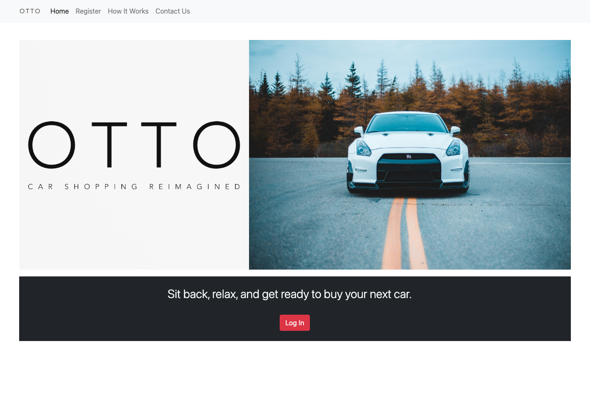

# OTTO
A car shopping app that streamlines the car shopping experience!

* **Purpose of the App:** 

   This app was created to provide both customers and dealerships a simple and straightforward process for making car deals. It allows the customer to place a request for a car that they are interested in. The car request is sent to dealerships that have the car in stock and the dealer is given the opportunity send an offer to the customer with their best price. Once the customer receives an offer, they may choose to accept or decline the offer. This process incentivizes the dealer to give their best offer possible since many dealers will be making offers on the same customer request.

* **How It Works:**  

   **Step 1:** Customer creates a request by selecting the make, model, min/max years, color, and max mileage of the desired vehicle. 
   **Step 2:** The request is sent to all dealers who currently have a vehicle in their inventory that matches the make and model of the requested vehicle. 
   **Step 3:** A dealer can respond to the customer request by submitting an offer with information about their offered vehicle along with their best price. 
   **Step 4:** Customer reviews all offers made on their request and accepts their favorite offer. 

* **Features of the App:**
   * Separate customer and dealer accounts log in from the same interface but are directed to different dashboards.
   * Dealers can easily manage their inventory by adding and deleting vehicles.
   * Car requests are automatically filtered based on a dealer's inventory so that dealers can just see the requests that they are able to fulfill.
   * A customer can receive multiple offers from different dealers on the same request. Once the customer accepts an offer, the request is removed for all dealers.
   
## Live link: 
https://otto-cars.herokuapp.com

## Site Preview: 

## Introduction video of the project: 
COMING SOON

## Database: 
This project is built using PostgreSQL with Sequelize-Object Relational Mapping

## Featured Tools: 
HTML, CSS, Bootstrap, JavaScript, Node.js, Mustache

## This site was created by:
[David Chen](https://github.com/DCXan) and [Calvin Nguyen](https://github.com/cnguyen2133l)
